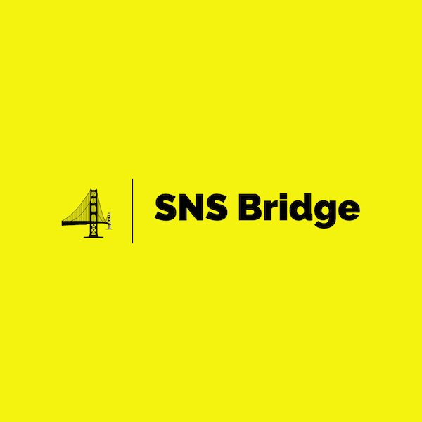

# SNS Bridge

Use SNS Bridge to connect your local development for [Chalice][0] apps to Amazon SNS

## How it Works

1. An HTTP server is started on your local machine
1. An [ngrok][1] tunnel is opened to the HTTP server
1. SNS Bridge subscribes the ngrok tunnel to your SNS topic
1. When a message is received, your SNS function is imported and called. This is done in a separate process each time to
   allow hot reloading.
1. When finished, SNS bridge cleans up after itself and unsubscribes from the topic. Assuming you don't force quit.

## Getting Started

### Pre-requisites
1. Setup an [ngrok][1] account.
1. Download and install their CLI tool and set your API key.

### Installation

Using Poetry (recommended):
```shell
poetry add --dev sns_bridge
```

If using PIP (not recommended as the SNS Bridge requirements might pollute your Chalice app requierements):
```shell
pip install sns_bridge
```

## Usage

You may always use `sns_bridge --help` to access this information.

```shell
Usage: sns_bridge [OPTIONS]

Options:
  --role-arn TEXT    ARN of the role to assume
  --port INTEGER     Port number to run
  --topic-name TEXT  SNS topic name  [required]
  --help             Show this message and exit.
```

### topic-name

The only required parameter, this is the name of the SNS topic you wish to subscribe to.

### role-arn

Optional. If you are using a multi-tier AWS account setup that requires you to "switch" or "assume" roles in order to
work with resources, pass the appropriate role ARN here.

### port

Optional. Defaults to a very high port number, 65500. Pass in a new port number if necessary.

[0]: https://github.com/aws/chalice
[1]: https://ngrok.com/